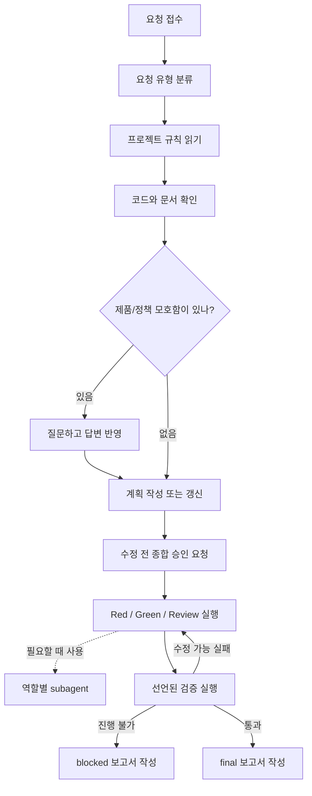

# PAVE

PAVE는 **Plan, Approve, Verify, Execute**의 약자입니다.

개발자가 아니어도 Codex나 Claude Code에게 자연어로 일을 맡길 수 있게 프로젝트 안에 작업 규칙, 계획서, 검증 기준, 역할별 보조 에이전트 문서를 만들어 주는 도구입니다.

기본 번들은 **PAVE + Superpowers**입니다. gstack은 선택 사항이며 full 설치 프로필에서 함께 확인합니다.

English documentation: [README.md](README.md)

## 누구에게 필요한가

- 기능 구현을 AI에게 맡기고 싶지만 중간 과정이 불안한 사람
- 버그 수정 후 정말 고쳐졌는지 확인까지 맡기고 싶은 사람
- 기획, 디자인, 개발, QA 관점을 한 세션 안에서 같이 점검하고 싶은 사람
- 새 프로젝트를 시작할 때 Overview, Roadmap, 개발 규칙, 배포 규칙, 디자인 규칙을 먼저 만들고 싶은 사람

## 설치 가이드

### Codex

Codex plugin manifest는 companion dependency를 선언할 수 없으므로 Superpowers를 먼저 설치합니다.

```bash
codex plugin add superpowers@claude-plugins-official
codex plugin marketplace add TaehoHong/pave --ref main
codex plugin add pave@pave
```

그 다음 대상 repo에서 새 Codex thread를 열고 다음처럼 요청합니다.

```text
Initialize this repository with PAVE.
```

이 과정에서 다음이 처리됩니다.

- `pave` marketplace를 통해 PAVE Codex plugin 설치
- default companion workflow로 Superpowers 사용
- 대상 repo에 `AGENTS.md`, `CLAUDE.md`, `.codex/pave/`, `.claude/`의 Claude Code adapter 파일, 초기 프로젝트 문서 생성

### Claude Code

같은 Git marketplace source에서 PAVE를 설치합니다.

```bash
claude plugin marketplace add TaehoHong/pave
claude plugin install pave@pave
```

그 다음 대상 repo에서 Claude Code를 열고 다음처럼 실행합니다.

```text
/pave Initialize this repository with PAVE.
```

Codex와 같은 PAVE runtime 파일을 공유합니다.

<details>
<summary>고급 옵션</summary>

```bash
# local source plugin 개발
git clone https://github.com/TaehoHong/pave.git
cd pave
./scripts/install_plugin.sh

# full companion profile로 repo runtime 수동 설치
./scripts/install.sh <repo-path> --companions full

# companion check 없이 repo runtime 수동/오프라인 설치
./scripts/install.sh <repo-path> --companions none

# 설정된 프로젝트 확인
./scripts/doctor.js <repo-path> --companions default

# companion 감지만 따로 문제 해결
./scripts/check_companions.sh --companions default

# local plugin 수정 후 재설치
codex plugin add pave@pave
```

</details>

## Codex와 Claude Code의 차이

| 항목 | Codex | Claude Code |
| --- | --- | --- |
| 호출 방법 | 자연어 요청, 필요하면 `$pave`로 명시 호출 | `/pave ...` |
| 최초 설치 | marketplace 등록 후 `codex plugin add pave@pave`로 Codex plugin 설치 | marketplace 등록 후 `claude plugin install pave@pave`로 Claude plugin 설치 |
| 기본 지시 파일 | `AGENTS.md` | `CLAUDE.md`, 그 다음 `AGENTS.md` |
| 상태 저장 | `.codex/pave/`의 공유 원본 | `.codex/pave/`의 공유 원본 |
| 역할별 agent | PAVE plugin role briefs | local discovery용 `.claude/agents/` adapter copy |
| companion workflow | Superpowers가 기본 필수 | 설치된 PAVE 계약을 따름 |

Codex가 1차 지원 대상입니다. 공유 원본은 `.codex/pave/`와 PAVE plugin role briefs이고, `.claude/agents/`는 Claude Code가 agent를 발견하기 위한 repo-local adapter copy입니다.

## Companion 정책

- 기본값: PAVE + Superpowers.
- gstack은 full profile을 선택할 때만 필수입니다.
- 오프라인 또는 특수 상황에서는 `--companions none`을 사용할 수 있습니다.

## 설치되는 파일

```text
repo/
├── AGENTS.md
├── CLAUDE.md
├── .claude/
│   ├── commands/pave.md        # Claude Code adapter command
│   └── agents/                 # Claude Code adapter copies for discovery
├── .codex/
│   └── pave/
│       ├── README.md
│       ├── README.kr.md
│       ├── config.md
│       ├── plans/
│       ├── reports/
│       ├── templates/
│       └── adapters/
└── docs/
    ├── 00-overview.md
    ├── 01-roadmap.md
    ├── 02-development-rules.md
    ├── 03-deployment-rules.md
    ├── 04-design-rules.md
    └── 05-quality-rules.md
```

## PAVE가 작업하는 방식

사용자가 기능 구현, 버그 수정, 기능 변경, 분석, 리뷰를 요청하면 PAVE는 보통 이렇게 움직입니다.



1. 프로젝트 규칙을 읽습니다.
2. 현재 코드와 문서를 확인합니다.
3. 기획, 정책, 디자인, 배포, 검증 기준에서 애매한 점을 먼저 질문합니다.
4. `.codex/pave/plans/`에 작업 계획을 만듭니다.
5. 코드나 테스트를 고치기 직전에 한 번만 종합 승인 요청을 합니다.
6. 구현, 리뷰, 검증을 진행합니다.
7. 필요한 경우 PM, 기획자, UI/UX 디자이너, 풀스택 개발자, QA 역할의 subagent를 사용합니다.
8. 선언된 검증 명령을 실행합니다.
9. 필요하면 `.codex/pave/reports/`에 final 또는 blocked 보고서를 남깁니다.

## 설치 확인

```bash
./scripts/doctor.js <repo-path> --companions default
```

Companion 감지만 따로 확인할 때는 `./scripts/check_companions.sh --companions default`를 사용합니다.

## Plugin 설치 구조

PAVE는 Codex plugin이면서 Claude Code plugin입니다. Codex는 `.codex-plugin/plugin.json`와 `.agents/plugins/marketplace.json`를 사용하고, Claude Code는 `.claude-plugin/plugin.json`와 `.claude-plugin/marketplace.json`를 사용합니다. Companion dependency는 plugin manifest가 아니라 설치 문서, local helper, doctor check에서 처리합니다.
