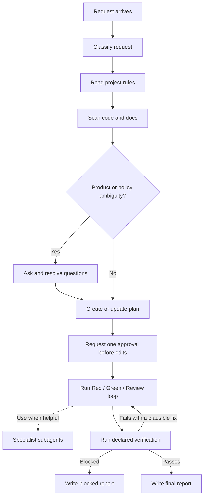

# PAVE

PAVE means **Plan, Approve, Verify, Execute**.

It is a Codex-first development harness that lets a person ask for software work in plain language while the agent plans, asks the important product questions, gets one approval before editing code, verifies the result, and reports what happened.

Default bundle: **PAVE + Superpowers**. gstack is optional and available through the full install profile.

Korean documentation: [README.kr.md](README.kr.md)

## Who It Is For

- People who want AI to implement features but still want clear planning and verification.
- Teams that want feature work, bug fixes, reviews, and docs updates to follow one repeatable process.
- Solo builders who want PM, planning, UI/UX, fullstack, and QA perspectives available as bounded subagents.
- New projects that should start with overview, roadmap, development, deployment, design, and quality rules.

## Installation Guide

### Codex

Install Superpowers first, because Codex plugin manifests cannot declare companion dependencies:

```bash
codex plugin add superpowers@claude-plugins-official
codex plugin marketplace add TaehoHong/pave --ref main
codex plugin add pave@pave
```

Then open a new Codex thread in your target repo and run:

```text
/project-init
```

What this does:

- initializes the PAVE runtime in the target repo
- uses Superpowers as the default companion workflow
- adds `AGENTS.md`, `CLAUDE.md`, `.codex/pave/`, Claude Code adapter files under `.claude/`, and starter project docs to the target repo

### Claude Code

Install PAVE from the same Git marketplace source:

```bash
claude plugin marketplace add TaehoHong/pave
claude plugin install pave@pave
```

Then open Claude Code in your target repo and run:

```text
/project-init
```

The same PAVE runtime files are shared with Codex.

<details>
<summary>Advanced options</summary>

```bash
# Local source plugin development
git clone https://github.com/TaehoHong/pave.git
cd pave
./scripts/install_plugin.sh

# Manual repo runtime install with the full companion profile
./scripts/install.sh <repo-path> --companions full

# manual/offline repo runtime install without companion checks
./scripts/install.sh <repo-path> --companions none

# Check a configured project
./scripts/doctor.js <repo-path> --companions default

# Companion-only troubleshooting
./scripts/check_companions.sh --companions default

# Reinstall after local plugin edits
codex plugin add pave@pave
```

</details>

## Codex vs Claude Code

| Topic | Codex | Claude Code |
| --- | --- | --- |
| Main command | Natural Codex request, or `$pave` when explicit routing is needed | `/pave ...` |
| First install | Codex plugin install via marketplace and `codex plugin add pave@pave` | Claude plugin install via marketplace and `claude plugin install pave@pave` |
| Primary instruction file | `AGENTS.md` | `CLAUDE.md`, then `AGENTS.md` |
| Runtime state | shared source of truth in `.codex/pave/` | shared source of truth in `.codex/pave/` |
| Role agents | PAVE plugin role briefs | `.claude/agents/` adapter copy for local discovery |
| Companion workflow | Superpowers required by default | Follows the installed PAVE contract |

Codex is the primary target. The shared PAVE source of truth stays in `.codex/pave/` and the PAVE plugin role briefs. `.claude/agents/` is a Claude Code adapter copy used for agent discovery.

Plugin commands include `/project-init` for first-time repo setup, `/pave` for
the standard workflow, and `/token-save` for splitting expensive reasoning from
lower-cost local implementation.

## Companion Policy

- Default: PAVE + Superpowers.
- gstack is optional unless you choose the full profile.
- Offline or unusual setups can use `--companions none`.

## What Gets Installed

```text
repo/
├── AGENTS.md
├── CLAUDE.md
├── .claude/
│   ├── commands/pave.md        # Claude Code adapter command
│   └── agents/                 # Claude Code adapter copies for discovery
├── .codex/
│   └── pave/
│       ├── README.md
│       ├── README.kr.md
│       ├── config.md
│       ├── plans/
│       ├── reports/
│       ├── templates/
│       └── adapters/
└── docs/
    ├── 00-overview.md
    ├── 01-roadmap.md
    ├── 02-development-rules.md
    ├── 03-deployment-rules.md
    ├── 04-design-rules.md
    └── 05-quality-rules.md
```

## How PAVE Works

When you ask for a feature, bug fix, change, analysis, or review, PAVE normally:



1. Reads project instructions.
2. Scans the relevant code and docs.
3. Asks product, policy, design, deployment, and verification questions before implementation.
4. Creates or updates a plan in `.codex/pave/plans/`.
5. Requests one consolidated approval immediately before code or test edits.
6. Executes the work with review and verification.
7. Uses bounded specialist subagents when helpful.
8. Runs declared verification commands.
9. Writes a final or blocked report in `.codex/pave/reports/` when useful.

## Check Installation

```bash
./scripts/doctor.js <repo-path> --companions default
```

Use `./scripts/check_companions.sh --companions default` only when troubleshooting companion detection.

## Plugin Install Mechanics

PAVE is both a Codex plugin and a Claude Code plugin. Codex uses `.codex-plugin/plugin.json` with `.agents/plugins/marketplace.json`; Claude Code uses `.claude-plugin/plugin.json` with `.claude-plugin/marketplace.json`. Companion dependencies are handled by install docs, local helpers, and doctor checks rather than plugin manifest dependency fields.
